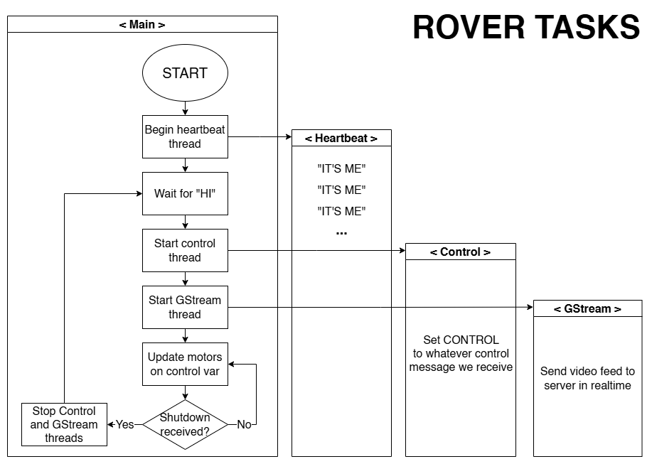
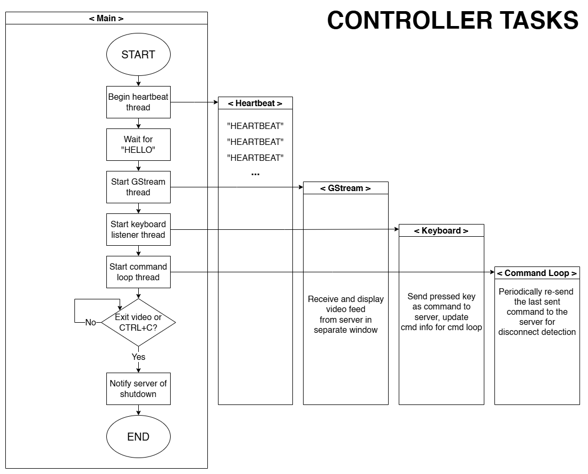

# Internet-Controlled Rover

## The Main Idea

The goal of this project is to create an RC car with a camera that is controlled through a WiFi internet connection
rather than using direct RF signals that require line-of-sight. A prime example of where this would work well is a
college campus, since they are often covered in campus-provided WiFi networks (even outside). Since the car will ideally
be operating far away from the location of the operator, and because it has an emphasis on exploration vs speed, going
forward it will be referred to as a "rover" instead.

## Demo

Below is a video of the rover in action. While attending my Advanced Digital Design class by Zoom in my dorm, I drove
the rover to the classroom where the class was taking place, waved to the professor, and left.
<br/>
<br/>
[](https://www.youtube.com/watch?v=W2qPE7Aoj7w)


## Hardware

### Parts List

1. Raspberry Pi Zero W [($30)](https://www.amazon.com/Bluetooth-Package-Raspberry-Pre-SolderedHeaders/dp/B0C3QHMMPT)
2. 32GB SD Card [($7)](https://www.amazon.com/PNY-Elite-microSDHC-Memory-P-SDU32GU185GW-GE/dp/B07R8GVGN9) – PNY
3. USB WiFi Adapter [($24)](https://www.amazon.com/wireless-USB-WiFi-Adapter-PC/dp/B08KHV7H1S) – Archer T4U Plus
4. 4WD TT Motor Chassis [($23)](https://www.amazon.com/Arduino-LK-COKOINO-Raspberry-Building/dp/B0B5JPJ9R4) – Cokoino CKK0011
   <br/>
   Build Instructions: https://github.com/cokoino/ckk0011
5. 5MP 1080P Arducam [($10)](https://www.amazon.com/Camera-Arducam-Raspberry-Raspbian-MotionEye/dp/B01LY05LOE) – OV5647
6. 5000 mAh USB Battery Pack [($13)](https://www.amazon.com/Miady-5000mAh-Portable-Charger-Android/dp/B08T8TDS8S) – Miady HYD009
7. 18650 Batteries with Charger [($22)](https://www.amazon.com/Intelligent-Charger-Universal-RechargeableBatteries/dp/B08GH7RLD1)
8. L293D Chip [($9)](https://www.amazon.com/BOJACK-16-pin-Stepper-Drivers-Controllers/dp/B09NBQVYLL) – Bojack
9. 80mm TT Motor Wheels [($7)](https://www.robotshop.com/products/80mm-silicone-wheel-tt-motor)
10. 18650 2-Slot Battery Storage Case [($7)](https://www.amazon.com/Battery-Storage-2x18650-Batteries-Container/dp/B09C1XFD3B)
11. Gaffers Tape [($20)](https://www.amazon.com/Professional-Gaffer-Power-Non-ReflectiveMultipurpose/dp/B00GZE3UJ8) – Gaffer Power
12. Steel Strap Tie [(88¢)](https://www.menards.com/main/hardware/fasteners-connectors/constructionhardware/structural-angles-straps/mitek-reg-1-1-4-light-duty-strap-tie/lsta9/p1444445507124-c-8815.htm) – MiTek

Total: $172.88
<br/>
_Prices updated December 2024_

### Assembly

<div style="flex">
 

</div>
<br/>
<br/>
The parts not easily identifiable in these angles are the 18650 battery holder, the USB
power bank, and the L293D chip. The 18650 battery holder is located under the USB WiFi
antennae, the USB power bank is located under the Pi Zero, and the L293D chip is at the center
of the nest of jumper wires.
<br/>
The wiring for the motors, L293D chip, and Pi Zero GPIO is done generally as follows:
one PWM signal, generated by the Pi, is used to drive all four motors. Due to the low speed of
the motors, the PWM signal simply acts as a switch, turning the motors on or off. One side of the
L293D chip is used to drive the 2 left side motors, and the other side is used to drive the 2 right
side motors. As stated previously, both sides use the same PWM signal. The difference in control
comes by changing the polarity of the motors. This will change the rotating direction of the left
and right side independently, allowing the rover to perform differential steering.

## Software

### Architecture

The constraint of symmetric Network Address Translation (NAT) was what determined the overall architecture of the project.
To learn about NAT in general see [this video](https://www.youtube.com/watch?v=FTUV0t6JaDA). To put it plainly, this project
requires that two internet-enabled devices can set up a two-way connection. Since both devices will likely be connected to
corporate or home networks, it must be assumed that both are behind a NAT-enabled router, meaning neither device has a public
IP address. Furthermore, it must be assumed that each device's network utilizes symmetric NAT, meaning that an external device
can talk to an internal device if and only if the internal device has (recently) sent a packet to that specific external device.
This rules out Session Traversal Utilities for NAT (STUN) which necessitates Traversal Using Relays around NAT (TURN).
<br/>
STUN works by having an external server determine the router-given public IP address & port of devices A and B
(i.e. 1.1.1.1:4822 and 2.2.2.2:2392), such that the server can then share the public address of device A with device B and
vice versa, allowing device A to connect directly to device B, now knowing device B's public address. This will not work under
a symmetric NAT because the address of device A given to device B by the server will only work for packets coming from the
server's address. If device B were to send packets to device A using the server's address for device A, the router would drop
the packets since device A has not explicitly sent device B any packets yet. This necessitates the backup method, TURN.
Essentially, device A and device B set up separate connections with some "relay" server. Then this server can relay messages from
A to B and B to A as requested, since it has a connection with both. Therefore, the architecture for this project follows a TURN
setup, albeit using a simplified, non-standard TURN implementation that's very specific to this project. For more information on
STUN and TURN, see [this video](https://www.youtube.com/watch?v=4dLJmZOcWFc).
A diagram of the project architecture is shown below.
<br/>
<br/>

<br/><br/>
The rover and controller are both assumed to be behind symmetric NAT-enabled routers, and so the server is used to relay packets
between the two. Both the rover and the controller must start their connections with the server by sending a repeating heartbeat
packet to the server. The source address of each heartbeat can be logged by the server, and the server can send a reply back
this address, since that follows the previously-mentioned rules of symmetric NAT. If the rover or controller were only to send
one heartbeat packet to initially establish their connection, then this connection, as maintained by the respective router, would
eventually timeout, even if the server was actively sending packets through the connection. So, the heartbeat is repeated (about
every 10s), by both the rover and controller to keep the connection alive. Once both connections are established, the rover will
send video data to the server, which will then relay the data to the controller. Similarly, the controller will send control data
to the server, which will then relay the data to the rover.

### Tech Stack

The rover, controller, and server all use [GStreamer](https://gstreamer.freedesktop.org/) for sending, receiving, and relaying
the video data. Unfortunately this does require that the controller device has GStreamer installed, significantly limiting the
portability of the project. The rover is run with a C program that utilizes the [pigpio](https://abyz.me.uk/rpi/pigpio/) library
for interfacing with the GPIO pins of the Raspberry Pi Zero W. Both the controller and server programs are python scripts for
simplicity. The controller uses the [pynput](https://pypi.org/project/pynput/) library for getting keyboard input.

### Task Diagrams

Below are diagrams detailing the general structure of the tasks run on the rover, controller, and server.
<br/>
<br/>

<br/>
<br/>

<br/>
<br/>

<br/>
<br/>

## Build Instructions

### Rover

The source for the C program that runs on the Raspberry Pi Zero W of the rover is located in the "rover" folder. 
This requires the pigpio library which can be downloaded and installed using [this guide](https://abyz.me.uk/rpi/pigpio/download.html).
Also required is GStreamer which can be downloaded and installed for Linux using [this guide](https://gstreamer.freedesktop.org/documentation/installing/on-linux.html).
The rover program can then be built on the Pi using the below command.
```
gcc -o main main.c pi_gpio_wrapper.c -lpigpio
```
For convenience, it is recommended to configure the main executable to run on startup as a system service with systemd
as explained well in [this article](https://www.thedigitalpictureframe.com/ultimate-guide-systemd-autostart-scripts-raspberry-pi).

### Controller

The source for the Python script that runs on the controller computer is located in the "controller" folder. This
script has only been tested on a Windows 10 PC but should be compatible with most systems. This script requires the
pynput library for getting keyboard input which can be installed used ```pip install pynput```. Also required is
GStreamer which can be downloaded and installed for Windows using [this guide](https://gstreamer.freedesktop.org/documentation/installing/on-windows.html).
The runtime installer should be sufficient. Be sure to follow the guide and ensure the ```gst-launch-1.0``` executable
is discoverable by your system PATH variable.

### Server

The source for the Python script that runs on the server computer is located in the "server" folder. This script
has only been tested on an x86 Linux Mint machine but should be compatible with most systems. This script requires
GStreamer which can be downloaded and installed for Linux using [this guide](https://gstreamer.freedesktop.org/documentation/installing/on-linux.html).
<br>
If the server restarts often, refer to the Rover section on how to use systemd to make the script autorun on startup.
<br>
Also, if the server is behind a NAT-enabled router, it is required to port-forward ports ```3658```, ```3659```, and ```3660```.
Specifically, ```3658``` and ```3659``` should allow inbound and outbound UDP traffic, but ```3660``` need only allow inbound UDP traffic.

## Run Instructions

The system is designed to allow any one device to be running regardless of the state of the other devices, however the
lone running device won't really do anything until all three devices are running and connected. For instance, the
rover and controller will repeatedly send out heartbeats if there is no server. If there is a server but no controller,
then the server will wait to respond to the rover until a controller has connected (essentially leaving the rover in
an idle heartbeat state). If there is a server and controller but no rover, the controller will send commands to the
server, but the server will route them to a loopback address (essentially dropping them). Therefore, it is recommended
to start the system in the following manner:
1. Start the server script with ```sudo python3 server.py``` (in this example, located on a machine with the hostname "myserver.com")
2. Start the rover program with ```sudo ./main myserver.com```
3. Start the controller script with ```python3 controller.py myserver.com```

After a maximum of ten seconds, the controller should be able to view the video feed of the rover and send commands to
the rover to drive it in real time.

## Known Bugs

### Random? Connection Dropout

After the introduction of the USB WiFi adapter, the rover would work really well and then randomly lose connection and
not regain the connection, requiring one to physically retrieve/restart the rover. This bug can be seen about halfway
through the demo video. This "magically went away" for a while, until it reappeared recently after the implementation
of the disconnect detection logic (where the rover will automatically stop moving 1 second after losing connection).
Now the rover will stay connected as long as it does not change access points, however, upon traveling far enough through a
building to change access points, it will lose connection and not come back. It is possible that this is a bug with the
disconnect detection logic, but it may also be the case that this is an issue with the driver for the USB WiFi adapter
itself, since the TP-Link Archer T4U Plus is not advertised to work with Linux (although somehow it partially does).

### L293D Burnout

The L293D chip used has a rated channel capacity of up to 600 mA. Each motor takes about 250 mA when operating on the
rover, and since there are two motors per channel that means that a normal operating environment will result in about a
500 mA load on each 600 mA channel. This should be fine, but it does not give much room for possible increased loads
when one or several wheels temporarily gets stuck. Before the disconnect detection logic was added, the rover would
often run into walls and keep pushing against them on disconnect. This would mean a greatly increased current load and
likely partially burnt out the first chip resulting in the turning issues that can be seen about halfway through the
demo video.
